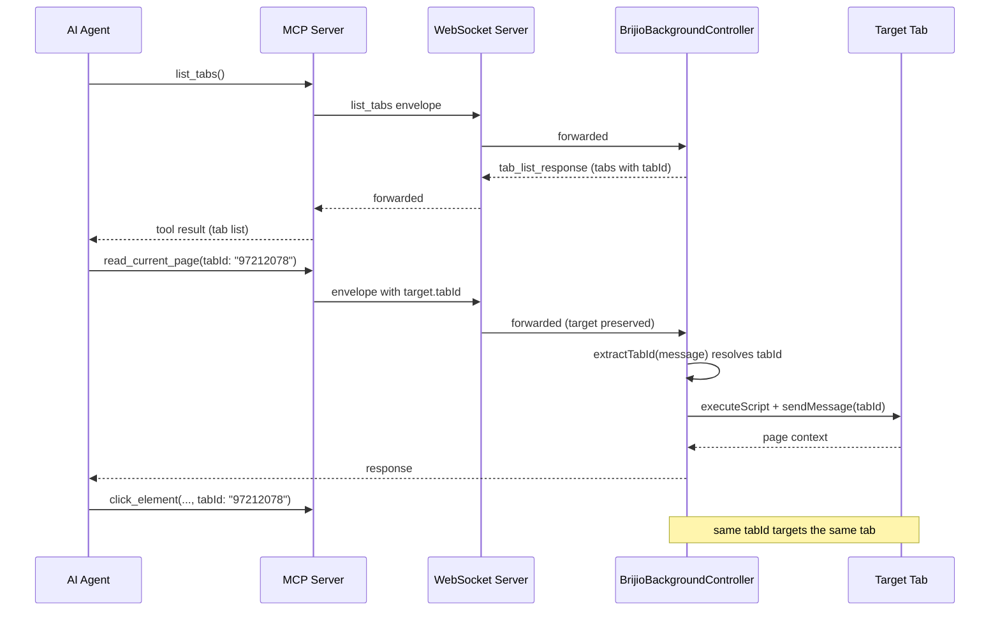

# Multi-tab Workflow

Brijio lets an agent operate on more than one browser tab within a single
connected extension. Targeting is **explicit and stateless**: every tool call
that touches a page accepts an optional `tabId` input that selects the tab to
act on. There is no hidden "selected tab" session state — the agent carries the
`tabId` it wants into each call, in the same way it carries
`browserInstanceId` for multi-browser targeting. When `tabId` is omitted the
system falls back to the active foreground tab, so all single-tab workflows
keep working unchanged.

The design is specified by three accepted/proposed ADRs that together form the
source of truth for this area:

- [ADR 0060 — Explicit Tab Listing and Selection](../../docs/architecture/decisions/0060-explicit-tab-listing-and-selection.md) — adds the `list_tabs` tool, the per-call `tabId` parameter on all tab-operating tools, the `target.tabId` envelope field, and the tab indicator UX.
- [ADR 0062 — Thread tabId Through the Entire Action Stack](../../docs/architecture/decisions/0062-thread-tabid-through-action-stack.md) — closes the extension-layer gap so `tabId` actually reaches `chrome.tabs.sendMessage(tabId, …)` instead of being dropped.
- [ADR 0063 — Open Tab Action](../../docs/architecture/decisions/0063-open-tab-action.md) — adds the `open_tab` tool that creates a new tab and returns its `tabId`.

## Recommended workflow

The canonical multi-tab loop, documented in both the `using-brijio` and
`navigation` skills, is:

1. **Discover** — call `list_tabs` (optionally with `browserInstanceId`) to get
   every open HTTP/HTTPS tab for the connected extension, including background
   tabs. Each returned tab carries a string `tabId`.
2. **Choose** — pick the `tabId` for the tab you want to work on.
3. **Target** — pass that `tabId` into every subsequent read, action, batch, and
   navigation call that should act on that tab.
4. **Hold** — keep using the same `tabId` until you intentionally switch tabs.
   There is no `select_tab` session default; per-call targeting is stateless.
5. **Re-read after navigation** — after `navigate_to_url` or any DOM mutation
   that invalidates the page snapshot, call `read_current_page` again (with the
   same `tabId`) to get fresh, short-lived element IDs. Element IDs from the
   previous page are invalid after navigation.

_The agent lists tabs, fixes a tabId, and reuses it across reads and actions; the WebSocket server forwards the envelope unchanged and the extension resolves `target.tabId`._

## How tabId flows end to end

`tabId` is a string at the MCP layer and is converted to a numeric Chrome/Safari
tab ID at the extension layer. The path is:

1. **MCP tool input** — each tab-operating tool declares an optional `tabId`
   input (`z.string().optional()` in `mcp-server.ts`, `tabId?: unknown` in the
   per-tool input interfaces). Tools normalize it via `normalizeTabId`, which
   rejects empty/non-string values with `invalid_tool_input`.
2. **MCP page-actions** — the tool passes `tabId` to a `page-actions.ts`
   function, which falls back to `config.defaultTabId` and then into a
   `request*` function in `websocket-client.ts`.
3. **WebSocket envelope** — `requestBrijio` builds the outgoing envelope with
   `target: { browserInstanceId?, tabId? }` only when a target field is
   present (the `targetEnvelope` helper omits `target` entirely when neither
   is set, so active-tab fallback callers send an unchanged envelope).
4. **WS server** — forwards the full envelope unchanged; `target.tabId` rides
   through to the extension.
5. **Extension controller** — `BrijioBackgroundController.handleSocketMessage`
   calls `extractTabId(message)`, which reads `message.target.tabId`, parses it
   to an integer, and returns `undefined` when absent. The numeric `tabId` is
   passed to the relevant handler (`handlePageContextRequest`,
   `handlePerformActionRequest`, `handlePerformBatchRequest`,
   `handleNavigateToUrlRequest`).
6. **Shared page-reader** — `readActiveTabPage`, `performActiveTabAction`, and
   `performActiveTabBatch` accept `tabId?: number`. When provided they use it
   directly as the `sendMessage`/`executeScript` target; when absent they call
   `tabs.query({ active: true, currentWindow: true })` and validate the URL
   with `isRegularPageUrl`. Before each read/action they also fire a
   `show_brijio_tab_indicator` message (best-effort, errors swallowed) so the
   user can see which tab Brijio is targeting.

The active-tab fallback is a hard invariant: every function in the stack must
fall back to the active tab when `tabId` is `undefined`, so existing callers
that omit `tabId` keep working. ADR 0062 exists precisely because the extension
layer originally ignored `tabId` — the MCP and WS layers were wired but the
extension silently dropped it, making `tabId` a no-op end-to-end.

### `open_tab` and the new-tab lifecycle

`open_tab` creates a tab rather than targeting an existing one. It is the tool
to reach for when a workflow needs two pages open simultaneously (comparison,
cross-referencing, opening an auth flow) without disrupting the user's current
tab. Unlike `navigate_to_url`, which navigates the current (or targeted) tab
and destroys its page state, `open_tab` leaves the working tab untouched.

- **Input** — `url` (required, HTTP/HTTPS only) and optional
  `browserInstanceId`. `open_tab` does **not** accept `tabId`: it creates a tab,
  so there is no existing tab to target. URL validation reuses the same
  `parseUrl` + `unsupportedSchemeResponse` pattern as `navigate_to_url`.
- **Return** — `{ tabId, url, title }`. The `tabId` is the new tab's ID and
  must be passed to every subsequent read/action on that tab. `title` may be
  empty until the page loads.
- **Extension adapter** — `pageOpenTab.openTab(url)` calls
  `chrome.tabs.create({ url })` (Chrome) / `browser.tabs.create({ url })`
  (Safari) and returns `String(tab.id)`. A failure surfaces as
  `open_tab_failed`. When `pageOpenTab` is not configured the controller
  returns `not_supported`.
- **No load wait** — the response resolves as soon as `tabs.create` resolves;
  it does not wait for the page to fully load. The agent should call
  `read_current_page` on the new `tabId` to verify the page loaded and get
  fresh element IDs, exactly as it would after `navigate_to_url`.
- **No ownership/close** — `close_tab` and tab ownership tracking are deferred
  (P2.5). The user closes tabs the agent opens; the agent can rediscover them
  via `list_tabs`.

## Which tools accept tabId

`tabId` is wired into the MCP input schema (`tabIdInput`) for every tool that
operates on a page: `read_current_page`, `click_element`, `fill_input`,
`fill_editable`, `set_checked`, `select_options`, `submit_form`,
`upload_file`, `perform_batch`, `navigate_to_url`, `download_status`,
`download_file`, `fetch_resource`, `capture_screenshot`, and even `list_tabs`
itself. `open_tab` is the one tab-related tool that intentionally does not take
`tabId`.

The extension controller threads `extractTabId`'s result into the page-context,
page-content, action, batch, and navigation handlers. `open_tab` and
`list_tabs` are dispatched without a `tabId` (open creates a tab; list is
browser-scoped, not tab-scoped).

> **Implementation note (gap to be aware of).** The MCP input schemas and the
> `PerformBatchInput` / `NavigateToUrlInput` interfaces declare `tabId`, and
> the underlying `page-actions.ts` functions (`performBatch`,
> `navigateToCurrentPageUrl`) and the WS client (`requestPerformBatch`,
> `requestNavigateToUrl`) all accept and forward `tabId`. However, the
> `perform_batch` and `navigate_to_url` tool wrappers do **not** currently pass
> `input.tabId` through to their `page-actions.ts` calls — so an agent that
> sends `tabId` to those two tools today will get active-tab behavior despite
> the schema advertising targeting. `read_current_page`, `click_element`,
> `fill_input`, `set_checked`, `select_options`, `submit_form`,
> `upload_file`, `capture_screenshot`, and the download/fetch tools that
> normalize and forward `tabId` are wired correctly. Treat the batch and
> navigate tool wrappers as the place to check/fix when editing this area.

## Fallback and failure semantics

- **Active-tab fallback.** Omitting `tabId` (or sending an empty/non-integer
  value, which `extractTabId` reduces to `undefined`) targets the active tab
  via `tabs.query({ active: true, currentWindow: true })`. This is the
  documented, preserved behavior — do not remove it unless an accepted ADR
  changes it.
- **Tab lifecycle races.** A tab can close between `list_tabs` and a
  `tabId`-targeted action. A missing/invalid active tab yields `no_active_tab`;
  `tabs.get`/`tabs.update` failures surface as `no_such_tab` / navigation
  errors. The `TabInfo` shape stores `tabId` as a string so it can later be
  aliased to opaque UUIDs for the cloud model without a protocol change.
- **Content-script injection.** Targeting a tab without a loaded content
  script makes `chrome.tabs.sendMessage` fail with "Could not establish
  connection" — an existing limitation, not addressed by the tabId work. The
  read/action path calls `executeScript` first to (re)load `content.js`, then
  sends the indicator message and the actual request.
- **Safari private mode.** `browser.tabs.query({})` may return an empty list in
  private mode; the agent can still target the active tab by omitting `tabId`.
- **URL filtering.** `list_tabs` only lists HTTP/HTTPS tabs (`isRegularPageUrl`
  excludes `chrome://`, `chrome-extension://`, `about:`, `file://`,
  `safari://`); incognito tabs are excluded.

## What to watch for when editing this area

- If you change any MCP tool that touches page state, confirm whether it
  should accept `tabId`, and make sure the tool wrapper actually forwards
  `input.tabId` to its `page-actions.ts` function (the `perform_batch` and
  `navigate_to_url` wrappers are the known gaps).
- Update the `using-brijio` and `navigation` skills together with tool behavior
  changes — they are the agent-facing contract for the multi-tab workflow and
  must match the tool schemas.
- Preserve the active-tab fallback in every layer (`page-reader.ts`,
  `background-controller.ts`, extension adapters) unless an accepted ADR
  changes it.
- `open_tab` must keep returning the new `tabId` and must keep rejecting
  non-HTTP(S) URLs; it should not gain a `tabId` input.
- ADRs 0060, 0062, and 0063 are the source of truth; reconcile any divergence
  with them.

## Related docs

- [Architecture: MCP ↔ WebSocket ↔ Extension flow](../architecture/mcp-extension-flow.md)
- [MCP tools and skills](../architecture/mcp-tools-and-skills.md)
- [Data and protocol](../data-and-protocol.md)
- ADR 0060, ADR 0062, ADR 0063 under `docs/architecture/decisions/`
- Skills: `servers/mcp/skills/using-brijio/SKILL.md`, `servers/mcp/skills/navigation/SKILL.md`
