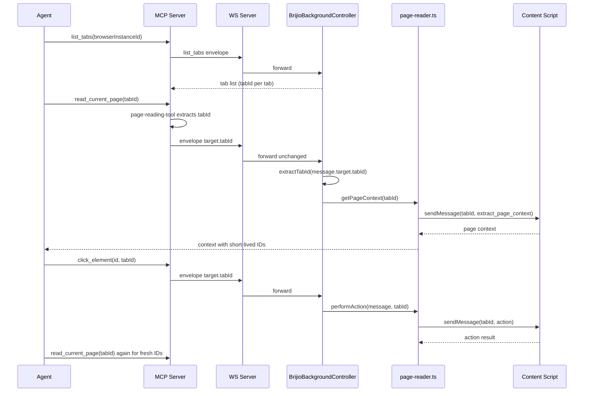

# Multi-tab Workflow

Brijio exposes explicit, per-call tab targeting through an optional `tabId`
parameter. An agent discovers tabs with `list_tabs`, chooses a `tabId`, and
passes it to subsequent reads, actions, batch, navigation, and screenshot calls.
Targeting is **stateless and per-call** — there is no session-level "selected
tab", mirroring how `browserInstanceId` works for multi-browser targeting (ADR
0060). When `tabId` is omitted, every layer falls back to the active foreground
tab, so existing single-tab callers keep working unchanged.

## Recommended workflow

1. `list_browsers` — confirm a browser is connected (always first).
2. `list_tabs` — discover all open tabs in that browser; each entry has a
   `tabId` (string), `title`, `url`, `active`, and `supported` flag.
3. Choose the `tabId` for the tab you want to work on.
4. Pass that `tabId` to every subsequent `read_current_page`, action,
   `perform_batch`, `navigate_to_url`, and `capture_screenshot` call.
5. Keep using the same `tabId` until you intentionally switch tabs.
6. **Re-read page context** (`read_current_page` with the same `tabId`) after
   navigation or any DOM mutation — element IDs are short-lived and expire when
   the page changes.

The list_tabs → read → act → re-read loop, with tabId carried on each call and parsed once by the controller.

## How tabId threads through the stack

`tabId` is a string at the MCP surface (raw Chrome/Safari tab ID as a string).
The MCP websocket-client places it in `envelope.target.tabId`. The WS server
forwards the envelope unchanged. `BrijioBackgroundController.handleSocketMessage`
calls `extractTabId(message)`, which reads `message.target?.tabId`, validates it
is a non-empty string, and parses it to a number; absent or invalid values yield
`undefined` (the active-tab fallback).

The shared `page-reader.ts` functions (`readActiveTabPage`,
`performActiveTabAction`, `performActiveTabBatch`) accept an optional numeric
`tabId`. When provided they use `deps.tabs.sendMessage(tabId, message)` and
`deps.scripting.executeScript({ target: { tabId } })` directly, skipping the
`tabs.query({ active: true, currentWindow: true })` lookup. When `tabId` is
`undefined` they query the active tab as before. The adapter interfaces in
`background-controller.ts` (`PageReaderAdapter`, `PageActionAdapter`,
`PageBatchAdapter`, `PageNavigationAdapter`) all carry `tabId?: number` through
to these functions.

### Active-tab fallback

When `tabId` is omitted (or cannot be parsed), every function resolves the tab
via `chrome.tabs.query({ active: true, currentWindow: true })`. This is the
single-tab behaviour Brijio had before ADR 0060/0062 and is preserved as a
backward-compatibility invariant: callers that never pass `tabId` are unaffected.

## Tools and their tabId support

The `tabId` input is declared in the MCP schema via the shared `tabIdInput`
zod field (`z.string().optional()`). Not every tool threads it end-to-end
though — see the gaps below.

| Tool                                                                                                          | Accepts `tabId`? | Threads to extension?                       | Notes                                                                                                                                                                       |
| ------------------------------------------------------------------------------------------------------------- | ---------------- | ------------------------------------------- | --------------------------------------------------------------------------------------------------------------------------------------------------------------------------- |
| `list_tabs`                                                                                                   | No               | N/A                                         | Takes `browserInstanceId`; returns the tab list.                                                                                                                            |
| `read_current_page` / `read_resource`                                                                         | Yes              | Yes                                         | Full chain through `page-reading-tool.ts` → `page-context.ts` → controller → `page-reader.ts`.                                                                              |
| `click_element`, `fill_input`, `fill_editable`, `set_checked`, `select_options`, `submit_form`, `upload_file` | Yes              | Yes                                         | `form-action-tools.ts` / `click-element-tool.ts` / `fill-input-tool.ts` extract `tabId` and pass it to `page-actions.ts`, which includes it in the envelope `target.tabId`. |
| `navigate_to_url`                                                                                             | Yes (schema)     | **No (dropped at tool layer)**              | See gap below.                                                                                                                                                              |
| `perform_batch`                                                                                               | Yes (schema)     | **No (dropped at tool layer)**              | See gap below.                                                                                                                                                              |
| `capture_screenshot`                                                                                          | Yes              | Forwarded, but extension is active-tab-only | See screenshot section.                                                                                                                                                     |
| `open_tab`                                                                                                    | No               | N/A                                         | Creates a tab and _returns_ the new `tabId`.                                                                                                                                |

### Known tabId-forwarding gaps

Two tools accept `tabId` in their MCP input schema and document it in the
navigation/using-brijio skills, but their tool wrappers drop it before it
reaches the tabId-capable downstream functions. Passing `tabId` to these tools
currently behaves like omitting it (active-tab fallback) unless
`config.defaultTabId` is set.

- **`navigate_to_url`** — `navigate-to-url-tool.ts` normalizes `url` and
  `browserInstanceId` but does not extract `tabId`; it calls
  `navigateToCurrentPageUrl(config, url, browserInstanceId)` without `tabId`.
  The downstream `page-actions.ts` `navigateToCurrentPageUrl` and the
  controller's `handleNavigateToUrlRequest(message.id, url, tabId)` both accept
  and forward `tabId`, so the gap is isolated to the tool wrapper. The
  `navigation` skill documents `navigate_to_url(url, tabId: "97212078")` to
  target a background tab, which is not yet effective end-to-end.
- **`perform_batch`** — the `mcp-server.ts` registration omits `input.tabId`
  when constructing the `performBatchTool` input, and `batch-tool.ts`
  `performBatchTool` does not include `tabId` in the options passed to
  `performBatch`. The downstream `page-actions.ts` `performBatch` supports
  `options.tabId`, and the controller forwards `tabId` to
  `handlePerformBatchRequest`, so again the gap is at the tool layer.

These are the kinds of gaps ADR 0062 ("thread tabId through the entire action
stack") was written to eliminate; if you edit either tool, confirm `tabId` is
extracted from the parsed input and forwarded as the final argument.

## Opening new tabs (`open_tab`)

`open_tab` opens a new browser tab at an HTTP(S) URL and returns the new tab's
`tabId` for subsequent targeting. It does **not** accept a `tabId` (it creates
one). It is stateless: there is no ownership tracking or `close_tab` (deferred
to P2.5).

Use it when a workflow needs two pages open simultaneously (comparison,
cross-referencing) without disrupting the user's current tab. The response
carries `tabId`, `url`, and `title` (title may be empty until the page loads).
The new tab may not be the active foreground tab, so always pass the returned
`tabId` to subsequent `read_current_page` and action calls — omitting it would
target the active tab, which may be a different page.

URL validation reuses the same `http`/`https` scheme check as
`navigate_to_url`; other schemes return `unsupported_scheme`. The
`open_tab_response` returns immediately after `tabs.create()` resolves and does
not wait for the page to fully load — call `read_current_page` on the new tab to
verify it loaded and obtain fresh element IDs.

## Screenshots (`capture_screenshot`)

`capture_screenshot` (ADR 0064) captures a viewport-only JPEG (quality 80) from
the **active tab**. The MCP tool accepts and normalizes `tabId` and forwards it
into the envelope, but the extension adapter
(`PageScreenshotAdapter.captureScreenshot()`) takes no `tabId` argument and uses
`tabs.captureVisibleTab()`, which can only capture the visible tab in a window.
Capturing a background tab would require switching focus (user-disruptive) and
is out of scope for P3.3.

To screenshot a specific tab, target its `tabId` only if it is already the
active tab, or use `open_tab` to create a dedicated tab and then capture it.

## Re-read invariant

Element IDs (`e5`, `f2`, `a1`, form IDs) are ephemeral. They expire on
navigation, form submission, or any DOM update. After `navigate_to_url`,
`click_element` that triggers navigation, or a `perform_batch` whose result
reports `data.aborted: true`, the agent must call `read_current_page` (with the
same `tabId`) before interacting with new elements. Brijio additionally tracks
visible form state: if the visible form structure changed between reading and
acting, the action fails with `stale_context` — re-read and retry. This is the
same invariant as single-tab operation, applied per-tab.

## Tab discovery and filtering

`list_tabs` returns only regular HTTP/HTTPS tabs. The extension filters using
`isRegularPageUrl()`, excluding `chrome://`, `chrome-extension://`, `about:`,
`file://`, and `safari://` schemes. Incognito tabs are excluded. The tab list is
fetched on demand via the explicit tool call — there is no ambient monitoring or
continuous streaming of tab updates.

When the agent targets a tab that is not the active tab, the extension injects a
content-script tab indicator (a `● ` prefix on `document.title` plus a
persistent in-page banner) so the user can see which tab Brijio is operating on.
Switching to a different tab hides the indicator on the previous tab and shows
it on the new one.

## Editing guidance

- If you change any MCP tool that touches page state, confirm whether it should
  accept `tabId`, and — critically — that the tool wrapper actually extracts and
  forwards `tabId` to the `page-actions.ts` / `page-context.ts` function (the
  `navigate_to_url` and `perform_batch` gaps above show how easy it is to accept
  the input in the schema but drop it in the wrapper).
- Update the `using-brijio` and `navigation` skills together with tool behaviour
  changes so agent-facing guidance matches actual end-to-end behaviour.
- Keep extension adapters in sync with the shared `page-reader.ts`: the
  `TabsApi` interface must expose `get` and `sendMessage`, and the Chrome/Safari
  adapters must forward `tabId` to `readActiveTabPage` /
  `performActiveTabAction` / `performActiveTabBatch`.
- Preserve the active-tab fallback unless a new ADR changes it.

## Related docs

- [Architecture: MCP ↔ WebSocket ↔ Extension flow](../architecture/mcp-extension-flow.md)
- [Data and protocol](../data-and-protocol.md)
- [Workflows](../workflows.md)
- ADR 0060 (explicit tab listing and selection), 0062 (thread tabId through the
  action stack), 0063 (open tab action), 0064 (screenshot tool)
- Capability matrix (`docs/project/CAPABILITY_MATRIX.md`)
