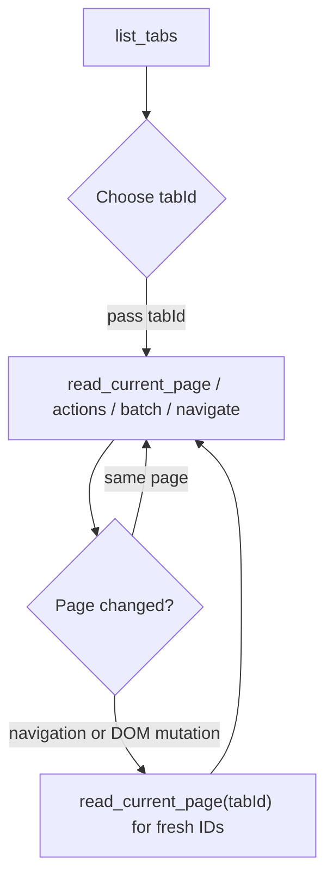
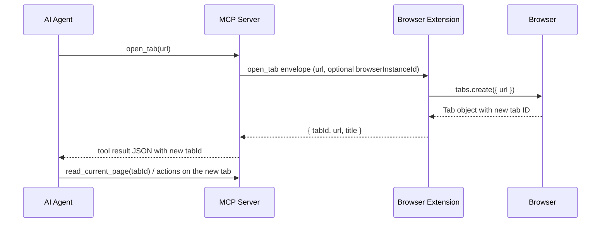

# Multi-tab Workflow

Brijio targets a specific browser tab explicitly, per tool call, through `tabId`.
There is no hidden "selected tab" session state: every read, action, batch, or
navigation call either receives a `tabId` and operates on that tab, or, when
`tabId` is omitted, falls back to the **active foreground tab** of the current
window (`tabs.query({ active: true, currentWindow: true })`). This keeps
multi-tab behavior explicit instead of implicit and lets an agent keep a stable
tab target across an entire workflow.

`tabId` is a **string** (e.g. `"97212078"`), not a number. Pass the exact value
returned by `list_tabs` or `open_tab`; the extension's `extractTabId` parses it
back into a numeric tab ID before threading it into the page-reader, page-action,
batch, and navigation handlers.

## Recommended workflow

1. Call `list_tabs` to discover the connected browser's open tabs (including
   background tabs). Each entry has a `tabId`, `title`, `url`, `active` flag, and
   `supported` flag (only HTTP/HTTPS tabs are supported).
2. Choose the `tabId` for the tab you want to work on.
3. Pass that `tabId` into every subsequent `read_current_page`, action,
   `perform_batch`, and `navigate_to_url` call.
4. Keep using the same `tabId` until you intentionally switch tabs.
5. Re-read page context after navigation or any DOM mutation that invalidates
   short-lived target IDs.

```mermaid
flowchart TD
    A["list_tabs"] --> B{"Choose tabId"}
    B -->|pass tabId| C["read_current_page / actions / batch / navigate"]
    C --> D{"Page changed?"}
    D -->|navigation or DOM mutation| E["read_current_page(tabId) for fresh IDs"]
    D -->|same page| C
    E --> C
```

Caption: One round of the multi-tab loop. A `tabId` chosen from `list_tabs` threads through every tool call; after navigation or DOM mutation the agent re-reads the same tab to refresh short-lived element IDs.

## How tabId threads through the stack

Tab ID targeting (ADR 0062) flows through four layers exactly once per call:

- **MCP tool wrappers** accept an optional per-call `tabId` (Zod `tabIdInput`,
  an optional string) and pass it through the `page-actions.ts` /
  `page-context.ts` wrappers.
- **`requestBrijio`** only adds a `target` block to the envelope when
  `browserInstanceId` and/or `tabId` are present, so requests without a target
  stay minimal.
- **The relay** forwards the envelope to the selected extension; it does not
  interpret tool payloads (except `list_browsers`, which it answers from
  presence).
- **`BrijioBackgroundController.handleSocketMessage`** extracts `tabId` once
  via `extractTabId` (parses `message.target.tabId` as a string into a safe
  integer) and threads that numeric ID into the matching handler. When `tabId`
  is absent the shared `page-reader.ts` helpers fall back to the active tab.

The shared read/action helpers in `packages/shared/src/page-reader.ts` prefer a
provided `tabId` over the active-tab lookup; Chrome and Safari adapters both
accept the resolved numeric `tabId` and use it for reads, actions, and
navigation.

## Opening new tabs (ADR 0063)

`open_tab(url)` lets the agent create a new tab instead of navigating the
current one away (which would destroy form state, scroll position, and dynamic
content) or using `fetch_resource` (which cannot render JavaScript or follow
auth-gated click-through). It is the tab-creating counterpart to `tabId`
targeting: it returns a new `tabId` for subsequent calls.

```mermaid
sequenceDiagram
    participant Agent as AI Agent
    participant MCP as MCP Server
    participant Ext as Browser Extension
    participant Browser as Browser

    Agent->>MCP: open_tab(url)
    MCP->>Ext: open_tab envelope (url, optional browserInstanceId)
    Ext->>Browser: tabs.create({ url })
    Browser-->>Ext: Tab object with new tab ID
    Ext-->>MCP: { tabId, url, title }
    MCP-->>Agent: tool result JSON with new tabId
    Agent->>MCP: read_current_page(tabId) / actions on the new tab
```

Caption: `open_tab` is tab-creating, so it does not accept `tabId`; it returns the new tab's ID for the agent to target next.

- The MCP tool (`servers/mcp/src/open-tab-tool.ts`) validates that `url` is a
  non-empty HTTP/HTTPS string and forwards only `url` + optional
  `browserInstanceId`. It deliberately does **not** accept `tabId` because it
  creates a tab rather than targeting an existing one.
- The controller's `handleOpenTabRequest` calls `pageOpenTab.openTab(url)` and
  returns `not_supported` if no `pageOpenTab` adapter is configured.
- Both Chrome and Safari adapters call `chrome.tabs.create({ url })` /
  `browser.tabs.create({ url })` and return `{ tabId: String(tab.id), url, title }`.
- The returned `tabId` is the raw browser tab ID as a string; the agent uses it
  with `read_current_page` or other tools to target the new tab. The new tab may
  not be the active foreground tab, so always pass the returned `tabId`.
- No `close_tab` or tab-ownership tracking exists yet (deferred to P2.5); the
  agent can `list_tabs` to discover tabs it opened.

### When to use open_tab

- The user asks to "open this in a new tab" or to keep the current page intact
  while working on a second one.
- A workflow needs two pages open simultaneously (comparison tasks,
  cross-referencing data) in the same browser.
- The user wants to open a URL but the current tab holds state you must not
  destroy.

### When not to use open_tab

- You just need to go to a URL on the current tab — use `navigate_to_url`.
- The user is already on the target page — just `read_current_page`.
- You need to follow a click path on the current page — use `click_element`.

## Screenshot constraint (ADR 0064)

`capture_screenshot` returns a JPEG (quality 80) of the **active tab's viewport
only**. It is the one tool that returns MCP `image` content rather than JSON
text, plus a metadata `text` block with `width`, `height`, `tabId`, and
`capturedAt`.

- `capture_screenshot` accepts an optional `tabId`, but the active-tab capture
  API (`tabs.captureVisibleTab`) is viewport-only and cannot target a background
  tab. The `tabId` is only validated to match the active tab; a mismatch returns
  `invalid_browser_target`. When `tabId` is omitted the active tab is captured.
- If the agent needs a screenshot of a specific tab, it should `open_tab` to
  create a dedicated tab (which becomes capturable as the active tab) rather than
  relying on `tabId` to capture a background tab.
- Both adapters query the active tab for its ID, call
  `captureVisibleTab(undefined, { format: 'jpeg', quality: 80 })`, strip the
  `data:image/jpeg;base64,` prefix, and return `{ dataBase64, width, height,
tabId, capturedAt }`. Dimensions are returned as `0` from the adapter today
  (real dimensions are not decoded at capture time).
- On failure the tool returns the JSON error with `isError: true`; error codes
  include `capability_not_supported` (no `pageScreenshot` adapter or permission
  error), `capture_failed`, and `no_visible_tab`.

Full-page scroll-stitch and annotation are out of scope for this phase (deferred
to P4.5 Visual Evidence).

## Short-lived IDs and staleness

Element IDs (`e5`, `f2`, `a1`, form IDs) are **ephemeral**. They expire when the
page changes — after navigation, form submission, or any DOM update. The page
context returned by `read_current_page` is the source of the IDs you pass into
actions and `perform_batch`.

- Always re-read the page with `read_current_page(tabId)` before interacting with
  elements if the page may have changed.
- If the visible form structure changes between reading and acting, actions fail
  with a `stale_context` error. On `stale_context`, re-read the page and retry.
- If `perform_batch` returns `data.aborted: true`, stop using IDs from the old
  page, call `read_current_page(tabId)`, and decide whether to retry against the
  fresh context.
- `perform_batch` runs up to 20 sequential write actions on the same page and
  accepts `tabId`; navigation aborts any remaining batch actions, so re-read
  before retrying. Reads stay separate except for the optional
  `readAfterActions: true`.

## Multiple browsers

When more than one browser instance is connected, always specify
`browserInstanceId` in tool calls; omitting it when multiple browsers are online
returns `ambiguous_browser_target`. `tabId` and `browserInstanceId` are
independent: `browserInstanceId` selects the browser, `tabId` selects the tab
within it.

## Editing guidance

- If you change any MCP tool that touches page state, confirm whether it should
  accept `tabId` and thread it through `target.tabId` so the shared helpers can
  prefer it over the active-tab lookup.
- `open_tab` must not accept `tabId` (it creates a tab) and must return the new
  tab's ID so subsequent calls can target it.
- `capture_screenshot` is the documented exception to full `tabId` targeting: it
  is active-tab/viewport-only by API constraint; keep the
  `invalid_browser_target` validation and the "open_tab for a dedicated capture"
  guidance in sync.
- Update the `using-brijio` and `navigation` skills together with tool behavior
  changes so the agent-facing workflow stays aligned with the tool surface.
- A tool input change usually requires coordinated updates in
  `servers/mcp/src/protocol.ts` (or `packages/shared/src/protocol.ts`) **and**
  the background controller: the envelope shape, the type guard, and the
  response builder must all stay aligned, and both Chrome and Safari adapters
  must implement any new adapter interface in the same change.
- Keep the active-tab fallback: when `tabId` is omitted the system uses the
  active tab — do not introduce hidden selected-tab session state.

## Canonical source files

- `servers/mcp/skills/using-brijio/SKILL.md` — agent-facing tool reference and
  multi-tab targeting guidance.
- `servers/mcp/skills/navigation/SKILL.md` — navigation and open-tab skill
  workflows.
- `servers/mcp/src/list-tabs-tool.ts` — `list_tabs` tool.
- `servers/mcp/src/page-reading-tool.ts` — `read_current_page` tool (`tabId`
  input, content chunking).
- `servers/mcp/src/page-actions.ts` — server-side wrappers that apply per-call
  `browserInstanceId`/`tabId` to reads, actions, batch, navigation, and
  screenshot.
- `servers/mcp/src/navigate-to-url-tool.ts` — `navigate_to_url` tool.
- `servers/mcp/src/open-tab-tool.ts` — `open_tab` tool (ADR 0063).
- `servers/mcp/src/capture-screenshot-tool.ts` — `capture_screenshot` tool
  (ADR 0064).
- `servers/mcp/src/batch-tool.ts` — `perform_batch` tool (max 20 actions,
  `tabId`, `continueOnError`, `readAfterActions`).
- `packages/shared/src/background-controller.ts` — extension-side dispatch,
  `extractTabId`, `handleScreenshotRequest`, and adapter interfaces.
- `packages/shared/src/page-reader.ts` — shared active-tab read/action helpers
  that prefer `tabId` over the active-tab lookup.

## Related docs

- [Architecture: MCP ↔ WebSocket ↔ Extension flow](../architecture/mcp-extension-flow.md)
- [Architecture Overview](../architecture.md)
- [Data and Protocol](../data-and-protocol.md)
- [Security](../security.md)
- [ADR 0062: Thread tabId through the action stack](../../docs/architecture/decisions/0062-thread-tabid-through-action-stack.md)
- [ADR 0063: Open Tab Action](../../docs/architecture/decisions/0063-open-tab-action.md)
- [ADR 0064: Visual Action Verification — Screenshot Tool](../../docs/architecture/decisions/0064-visual-action-verification.md)
- [Capability matrix](../../docs/project/CAPABILITY_MATRIX.md)
- [Roadmap](../../docs/project/ROADMAP.md)
