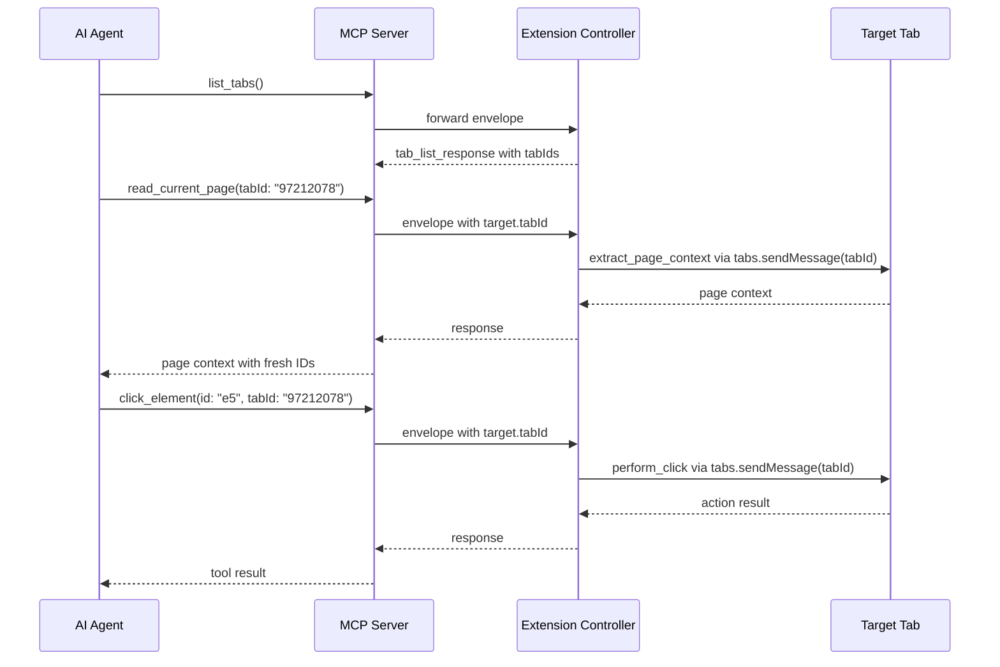

# Multi-tab Workflow

Brijio lets an agent target any connected browser tab on each tool call through
an optional `tabId` parameter. Targeting is **per-call and stateless**: there is
no hidden "selected tab" session state, consistent with the `browserInstanceId`
targeting model and the AGENTS.md invariant that forbids selected-browser or
selected-tab session state. When `tabId` is omitted, every tool falls back to
the active foreground tab, so existing single-tab callers keep working
unchanged. ADRs 0060, 0062, and 0063 are the source of truth for this behavior;
ADR 0064 covers the screenshot exception.

The full request path — MCP tool to WebSocket relay to extension controller to
browser tab — is documented in [MCP ↔ WebSocket ↔ Extension Flow](../architecture/mcp-extension-flow.md).
This page covers the _agent-facing_ workflow: how to discover tabs, target
them, open new ones, and keep short-lived IDs valid.

## The recommended targeting loop

1. **Discover tabs.** Call `list_tabs` to enumerate the connected browser's open
   tabs. Each entry returns a `tabId` plus `title`, `url`, `active`, and
   `supported` metadata.
2. **Choose a tab.** Match the tab by `title`/`url`, or use the `active` flag to
   pick the foreground tab.
3. **Pass `tabId` into every subsequent call.** Reads, actions, batch, and
   navigation all accept the same optional `tabId`; reuse it until you
   intentionally switch tabs.
4. **Re-read after navigation or mutation.** Short-lived element IDs
   (`bb-1`, `e5`, …) expire when the page changes. After `navigate_to_url`,
   form submission, or any DOM change, call `read_current_page` again (with the
   same `tabId`) before interacting with elements.


```mermaid
sequenceDiagram
    participant Agent as AI Agent
    participant MCP as MCP Server
    participant Ext as Extension Controller
    participant Tab as Target Tab

    Agent->>MCP: list_tabs()
    MCP->>Ext: forward envelope
    Ext-->>MCP: tab_list_response with tabIds
    Agent->>MCP: read_current_page(tabId: "97212078")
    MCP->>Ext: envelope with target.tabId
    Ext->>Tab: extract_page_context via tabs.sendMessage(tabId)
    Tab-->>Ext: page context
    Ext-->>MCP: response
    MCP-->>Agent: page context with fresh IDs
    Agent->>MCP: click_element(id: "e5", tabId: "97212078")
    MCP->>Ext: envelope with target.tabId
    Ext->>Tab: perform_click via tabs.sendMessage(tabId)
    Tab-->>Ext: action result
    Ext-->>MCP: response
    MCP-->>Agent: tool result
```

_The targeting loop: list_tabs returns a tabId, which the agent threads into every subsequent read and action via the envelope's `target.tabId`._

## Discovering tabs with `list_tabs`

`list_tabs` is a discovery tool that mirrors `list_browsers`. The MCP wrapper in
`servers/mcp/src/list-tabs-tool.ts` delegates to `requestListTabs`, which sends
a `list_tabs` envelope; the extension's `tabLister` adapter answers with a
`tab_list_response` carrying a `tabs` array.

Each `TabInfo` (`packages/shared/src/protocol.ts`) exposes:

- `tabId` — the raw browser tab ID as a **string** (e.g. `"97212078"`). Pass this
  value verbatim to other tools; do not convert or truncate it.
- `windowId` — the browser window ID as a string.
- `title`, `url` — page title and full HTTP/HTTPS URL.
- `active` — whether this is the user's currently focused tab.
- `supported` — whether the tab is eligible for Brijio actions (always `true`
  for listed tabs, because listing already filters to supported pages).

**Tab exclusion.** The extension queries all tabs with `tabs.query({})` and
filters with `isRegularPageUrl()` so only regular `http`/`https` pages are
listed. `chrome://`, `chrome-extension://`, `about:`, `file://`, and
`safari-extension://` schemes are excluded, and incognito tabs are not listed.
This shared `isRegularPageUrl` check is the same one `open_tab` and
`navigate_to_url` use to validate URLs.

## Per-call `tabId` threading

`tabId` rides on the envelope's `target` field, alongside `browserInstanceId`:

```
target: { browserInstanceId?: string, tabId?: string }
```

The path is:

1. **MCP tool schema** — every tab-operating tool registers an optional
   `tabId` Zod string input (`servers/mcp/src/mcp-server.ts`). `open_tab` is the
   one exception: it _creates_ a tab, so it has no `tabId` input (only `url` and
   `browserInstanceId`).
2. **MCP wrapper** — per-tool files extract and normalize `tabId` and pass it
   to `page-actions.ts` / `page-context.ts`, which carry it on
   `PageContextRequestOptions`.
3. **`websocket-client.ts`** — `targetEnvelope` stamps `target.tabId` onto the
   outgoing message only when `browserInstanceId` or `tabId` is present, so
   callers that omit both send a bare envelope.
4. **WebSocket relay** — forwards the full envelope, including `target`,
   unchanged to the extension.
5. **`BrijioBackgroundController.handleSocketMessage`** — `extractTabId(message)`
   reads `message.target.tabId` (a string), parses it to an integer with
   `Number.parseInt`, and returns `undefined` when absent or non-numeric. The
   integer is forwarded to every handler (`handlePageContextRequest`,
   `handlePerformActionRequest`, `handlePerformBatchRequest`,
   `handleNavigateToUrlRequest`).
6. **Shared `page-reader.ts`** — `readActiveTabPage`, `performActiveTabAction`,
   and `performActiveTabBatch` use the numeric `tabId` directly when present
   (`resolvedTabId = tabId`) and **skip** the
   `tabs.query({ active: true, currentWindow: true })` lookup. When `tabId` is
   `undefined` they fall back to the active tab. `navigateActiveTabToUrl`
   applies the same pattern: `chrome.tabs.update(tabId, { url })` when `tabId`
   is present, the active-tab query otherwise.

The `tabId` is therefore a **string at the MCP/protocol layer and an integer in
the extension layer**; the conversion happens once in `extractTabId`. Pass the
exact `tabId` string returned by `list_tabs` or `open_tab`.

### Active-tab fallback

When `tabId` is omitted (or not a safe integer after parsing), every function in
the stack falls back to the active tab via `tabs.query({ active: true,
currentWindow: true })`. This is the backward-compatible default: a single-tab
agent that never calls `list_tabs` and never passes `tabId` operates on the
foreground tab exactly as before. There is **no selected-tab default** —
targeting is redeclared on each call.

## Opening new tabs with `open_tab`

`open_tab` creates a new browser tab at an HTTP(S) URL and returns its `tabId`
so the agent can immediately target it. It fills the gap that `navigate_to_url`
(leaves the current page) and `fetch_resource` (raw HTML, no rendering) cannot:
the agent opens a reference or auth-flow page, reads it, interacts with it, and
the user's original tab stays untouched.

**Behavior:**

- The extension adapter calls `tabs.create({ url })` (`chrome.tabs.create` on
  Chrome, `browser.tabs.create` on Safari) and returns the new tab's numeric ID
  as a string along with `url` and `title` (title may be empty until the page
  loads).
- URL validation reuses `parseUrl` + the HTTP/HTTPS scheme check shared with
  `list_tabs` and `navigate_to_url`; other schemes return
  `unsupported_scheme`.
- `open_tab` does **not** wait for the page to fully load — the response
  resolves as soon as `tabs.create` returns. To verify the page loaded and get
  fresh element IDs, call `read_current_page` with the returned `tabId`.
- There is no `tabId` _input_ (the tool creates a tab), and no `close_tab` or
  ownership tracking — the agent discovers tabs it opened via `list_tabs`, and
  the user closes them.

**Workflow:**

```
open_tab(url: "https://example.com")       → { tabId: "12345", url, title }
read_current_page(tabId: "12345")          → page context with fresh IDs
click_element(kind: "link", id: "e5", tabId: "12345")
```

Always pass the returned `tabId` to subsequent calls. The new tab may not be
the active foreground tab, so omitting `tabId` could silently target a
different page.

## Screenshot targeting (`capture_screenshot`)

`capture_screenshot` (ADR 0064) is the one tab-targeting tool whose `tabId`
handling is constrained by a browser API limitation. The tool accepts an
optional `tabId` in its schema, but the capture is a **viewport-only JPEG of the
active/visible tab** taken with `tabs.captureVisibleTab()` — there is no way to
capture a background tab without switching focus, which would be user-disruptive.
This is an active-tab-oriented capture bound to the window's active tab, **not**
a hidden selected-tab capture.

In practice both the Chrome and Safari adapters query the active tab
(`tabs.query({ active: true, currentWindow: true })`) and report its ID as
`tabId` in the result, then call `captureVisibleTab(undefined, { format:
'jpeg', quality: 80 })`. If a `tabId` is provided it is forwarded through the
envelope, but the visible-tab capture is bound to the window's active tab
regardless. To screenshot a specific page, open a dedicated tab with `open_tab`
and make it active, or capture the active tab directly. The result returns MCP
`image` content plus a text metadata block (`width`, `height`, `tabId`,
`capturedAt`).

## Stale context and re-reading

Action targets use short-lived positional IDs generated by `read_current_page`.
The content script tracks page navigation (ADR 0036) and visible form state
(ADR 0041) to prevent silently acting on the wrong element:

- **`pageContextId`** is a monotonic counter incremented on every `pageshow`
  event. If an action's `pageContextId` does not match the content script's
  current version, the action fails with `page_navigated` — the whole previous
  snapshot is stale; re-read.
- If validation fields (`expectedText`, `expectedHref`, `expectedRole`,
  `expectedLabel`) mismatch but the page has not navigated, the action fails
  with `stale_context` — re-read and retry.
- **`visibleContextId`** tracks visible form structure; if it changes between
  read and action, the action fails with `stale_context`.

These checks are per-tab: context is returned per read, so the same
`pageContextId`/`visibleContextId` validation works across targeted tabs
without additional cross-tab coordination. After `navigate_to_url` (on any
tab), `perform_batch` with `readAfterActions: true`, or any action that
navigates, call `read_current_page` with the same `tabId` before using new
IDs.

## Cross-browser parity

Chrome and Safari implement the same tab surface. Both extensions use the
shared `BrijioBackgroundController` and `page-reader.ts`, and the same
adapter interfaces (`TabListerAdapter`, `PageOpenTabAdapter`,
`PageNavigationAdapter`, `PageReaderAdapter`, `PageActionAdapter`,
`PageBatchAdapter`, `PageScreenshotAdapter`). `tabs.query({})`,
`tabs.create({ url })`, `tabs.update(tabId, { url })`, and
`tabs.captureVisibleTab` are standard WebExtensions APIs available on both.
`list_tabs` reports `windowId: '0'` and `active: false` for all listed tabs in
the current implementation; rely on `title`/`url` to identify tabs rather than
the `active` flag, and use `list_tabs` freshly each time you need to target a
specific tab rather than caching IDs across long workflows.

## Editing guidance

When changing anything in this area, several files move together:

- **Any MCP tool that touches page state** should be checked for whether it
  should accept `tabId`. Thread it through `page-actions.ts` →
  `websocket-client.ts` (`target.tabId`) → `extractTabId` → the adapter; a
  field accepted by the MCP schema but ignored by the controller becomes a
  silent no-op end-to-end.
- **Update the `using-brijio` and `navigation` skills together** with tool
  behavior changes — both skills document the `tabId` workflow and the
  `open_tab` loop.
- **Keep `background-controller.ts` and the Chrome/Safari adapters in sync.**
  The shared `page-reader.ts` functions and both extension background scripts
  must forward `tabId` to the shared read/action/batch/navigation entrypoints.
- **Preserve the active-tab fallback** unless an accepted ADR changes it, and
  never introduce selected-tab session state.
- **Re-read after navigation or mutation** that can invalidate short-lived
  target IDs — this is the workflow's core safety rule.

## Related docs

- [MCP ↔ WebSocket ↔ Extension Flow](../architecture/mcp-extension-flow.md)
- [Data and protocol](../data-and-protocol.md)
- [Workflows](../workflows.md)
- [ADR 0060 — Explicit tab listing and selection](../../docs/architecture/decisions/0060-explicit-tab-listing-and-selection.md)
- [ADR 0062 — Thread tabId through the action stack](../../docs/architecture/decisions/0062-thread-tabid-through-action-stack.md)
- [ADR 0063 — Open tab action](../../docs/architecture/decisions/0063-open-tab-action.md)
- [ADR 0064 — Visual action verification (screenshot)](../../docs/architecture/decisions/0064-visual-action-verification.md)
