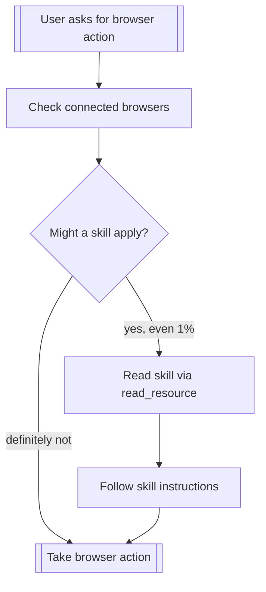

# Using Brijio

Brijio connects your AI agent to the user's real browser. The browser
extension is only active while the user explicitly starts it, so always check
for connected browsers first.

## Before You Do Anything

**Read the relevant skill BEFORE taking any browser action.** Even a 1% chance
a skill applies means you should read it. If the skill turns out to be
irrelevant, move on — but check first.



## Available Skills

Skills are MCP resources. Read a skill's full instructions with
`read_resource` using the URI format:

```
skill://brijio/{skill_name}
```

| Skill Name        | URI                              | When to Use                                              |
| ----------------- | -------------------------------- | -------------------------------------------------------- |
| `using-brijio`    | `skill://brijio/using-brijio`    | Every session — orientation and tool reference           |
| `form-filling`    | `skill://brijio/form-filling`    | Any task involving filling out web forms                 |
| `data-extraction` | `skill://brijio/data-extraction` | Any task involving extracting data from web pages        |
| `web-qa`          | `skill://brijio/web-qa`          | Any task involving testing or verifying web app behavior |
| `navigation`      | `skill://brijio/navigation`      | Navigating to a URL directly or via click-through flows  |
| `comparison`      | `skill://brijio/comparison`      | Comparing two pages or browser views side by side        |
| `accessibility`   | `skill://brijio/accessibility`   | Auditing a page for accessibility issues                 |
| `ecommerce`       | `skill://brijio/ecommerce`       | E-commerce checkout flows (cart, shipping, payment)      |
| `onboarding`      | `skill://brijio/onboarding`      | New account registration and profile setup               |
| `monitoring`      | `skill://brijio/monitoring`      | Periodic page monitoring via cron jobs                   |

## Available Tools

### Discovery

| Tool                | Purpose                                                           |
| ------------------- | ----------------------------------------------------------------- |
| `list_browsers`     | Check which browsers are connected. **Always call this first.**   |
| `read_current_page` | Get the current page context (URL, title, forms, links, actions). |
| `read_resource`     | Read Brijio content chunks for large pages (paginated).           |

### Interaction

| Tool              | Purpose                                 | Key Parameters                                   |
| ----------------- | --------------------------------------- | ------------------------------------------------ |
| `navigate_to_url` | Navigate the browser to an HTTP(S) URL  | `url` (required), `browserInstanceId` (optional) |
| `click_element`   | Click a link or button-like action      | `kind` ("link" or "action"), `id` (short-lived)  |
| `fill_input`      | Write text into a form control          | `formId`, `controlId`, `text`                    |
| `fill_editable`   | Write text into a contenteditable area  | `id`, `text`                                     |
| `set_checked`     | Check/uncheck a checkbox or radio       | `formId`, `controlId`, `checked` (boolean)       |
| `select_options`  | Select option values in a `<select>`    | `formId`, `controlId`, `values` (string array)   |
| `submit_form`     | Submit a form                           | `formId`                                         |
| `perform_batch`   | Execute up to 20 explicit write actions | `actions`, `continueOnError`, `readAfterActions` |

Use `perform_batch` only after reading the current page and choosing valid
short-lived IDs from that page context. It is for compact sequences of write
actions on the same page, such as filling several fields and setting a checkbox.
Do not use it for hidden reads or open-ended automation: reads stay separate
except for optional `readAfterActions: true`.

### Critical: Short-Lived IDs

Element IDs (`e5`, `f2`, `a1`, form IDs) are **ephemeral**. They expire when
the page changes — including after navigation, form submissions, or DOM updates.

**Always re-read the page with `read_current_page` before interacting with
elements if the page may have changed.**

If `perform_batch` returns `data.aborted: true`, stop using IDs from the old
page, call `read_current_page`, and decide whether to retry against the fresh
context.

## Step 1: Check Connection

Every Brijio session starts with a connection check:

```
→ list_browsers
← { browsers: [{ browserInstanceId: "chrome-abc123", name: "Chrome" }] }
```

If no browsers are connected, tell the user and stop. If multiple browsers are
connected, specify `browserInstanceId` in all subsequent calls.

## Step 2: Read the Page

```
→ read_current_page(includeContent: true)
← { url, title, forms, links, actions, editables, ... }
```

This gives you the full page context with short-lived IDs you'll use in
subsequent tool calls.

## Step 3: Choose the Right Skill

| User intent                                              | Skill to read                                        |
| -------------------------------------------------------- | ---------------------------------------------------- |
| "Fill in this form" / "Apply" / "Sign up"                | `skill://brijio/form-filling`                        |
| "Get this data" / "Extract the table" / "Scrape"         | `skill://brijio/data-extraction`                     |
| "Test this page" / "Check if X works" / "Find bugs"      | `skill://brijio/web-qa`                              |
| "Go to Settings → Privacy" / "Navigate to admin"         | `skill://brijio/navigation`                          |
| "Open https://example.com" / "Go to this URL"            | `skill://brijio/navigation`                          |
| "Compare staging vs prod" / "Check mobile vs desktop"    | `skill://brijio/comparison`                          |
| "Check accessibility" / "Audit a11y" / "WCAG check"      | `skill://brijio/accessibility`                       |
| "Buy this" / "Checkout" / "Apply coupon"                 | `skill://brijio/ecommerce`                           |
| "Sign up for X" / "Create account" / "Onboard"           | `skill://brijio/onboarding`                          |
| "Monitor this page" / "Alert on changes" / "Price watch" | `skill://brijio/monitoring`                          |
| Any other browser task                                   | Default to reading the page and using tools directly |

## Red Flags

These thoughts mean STOP — you're about to make a mistake:

| Thought                                       | Reality                                                              |
| --------------------------------------------- | -------------------------------------------------------------------- |
| "I'll just fill in the password field"        | `fill_input` returns `browser_error` for password fields. Skip them. |
| "The ID from the last page should still work" | IDs expire on navigation or DOM updates. Re-read the page.           |
| "I'll submit the form for the user"           | Never auto-submit. Always ask the user to confirm.                   |
| "I'll just click without checking"            | Radio buttons cannot be unchecked. Select carefully.                 |
| "I'll batch across pages"                     | Navigation aborts remaining batch actions. Re-read before retrying.  |
| "I don't need to read a skill for this"       | If there's even a 1% chance a skill applies, read it.                |
| "I'll skip the connection check"              | No browser = no action. Always call `list_browsers` first.           |

## User Instructions Always Win

Brijio skills override default system behavior, but **user instructions
always take precedence**. If the user explicitly says "skip the skill" or
"just click the button," follow the user's request.

## Multiple Browsers

When more than one browser instance is connected, **always** specify
`browserInstanceId` in tool calls. Omitting it when multiple browsers are
available will return an `ambiguous_browser_target` error.
